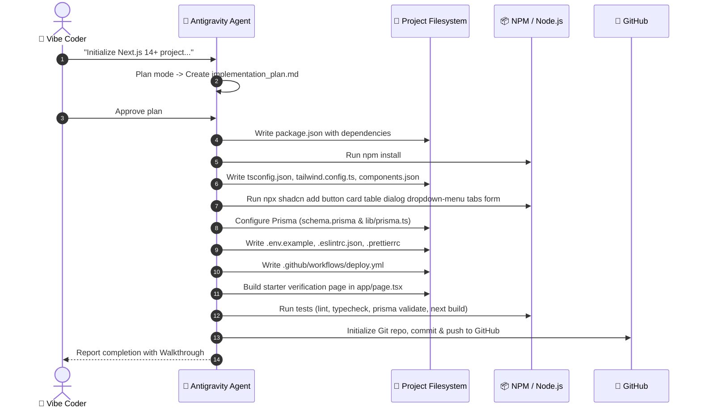

# 🚀 Step 1: Project Initialization & Infrastructure Setup

This guide breaks down **every single action** the Antigravity agent took to initialize the Travel CRM SaaS project, why those choices were made, and how each component fits together.

---

## 🎯 Goal of This Step
Create a bulletproof, enterprise-ready Next.js 14+ TypeScript baseline with:
- Tailwind CSS & Shadcn UI (for beautiful, accessible UI components)
- Prisma ORM configured with a PostgreSQL datasource
- ESLint & Prettier for clean, consistent code
- Standard multi-tenant SaaS environment variables template (`.env.example`)
- Automated CI/CD GitHub Actions workflow
- Standard project structure (`/app`, `/components`, `/lib`, `/prisma`)

---

## 🛠️ Actions Taken by Antigravity (Step-by-Step)



---

## 🔍 Detailed Breakdown of Each Step

### 1. Package & Dependency Setup (`package.json`)
The agent created `package.json` with the following critical packages:
- **`next` (v14.2+) & `react` (v18.3+)**: Industry-standard React server framework with App Router support.
- **`tailwindcss` & `tailwindcss-animate`**: Utility-first CSS engine with built-in animation utilities.
- **`@prisma/client` & `prisma`**: Next-generation TypeScript ORM to talk to PostgreSQL.
- **`@radix-ui/*`**: Unstyled, accessible UI primitives (modals, dropdowns, tabs) that power Shadcn UI.
- **`react-hook-form` & `zod` & `@hookform/resolvers`**: Type-safe form handling and schema validation.
- **`lucide-react`**: Clean, modern icons.

### 2. Styling System & Design Tokens
- **`tailwind.config.ts`**: Configured custom color variables using HSL format (e.g. `hsl(var(--primary))`).
- **`app/globals.css`**: Defines the light/dark mode color palettes (backgrounds, borders, cards, destructive states, accents).
- **`components.json`**: The official Shadcn configuration that defines how components are installed into `@/components/ui`.
- **`lib/utils.ts`**: Contains the `cn()` function which merges Tailwind classes and resolves conflicts using `clsx` and `tailwind-merge`.

### 3. Shadcn UI Components Installation
The agent installed the fundamental Shadcn components:
- `button.tsx`: Configurable button with primary, secondary, destructive, outline, and ghost variants.
- `card.tsx`: Card container with Header, Title, Description, Content, and Footer.
- `table.tsx`: Clean data table component.
- `dialog.tsx`: Accessible modal popup.
- `dropdown-menu.tsx`: Contextual action menu.
- `tabs.tsx`: Tabbed view switcher.
- `form.tsx`, `input.tsx`, `label.tsx`: Form building blocks wired into React Hook Form.

### 4. Database Layer (`prisma/schema.prisma` & `lib/prisma.ts`)
- **`prisma/schema.prisma`**:
  ```prisma
  generator client {
    provider = "prisma-client-js"
  }

  datasource db {
    provider = "postgresql"
    url      = env("DATABASE_URL")
  }
  ```
- **`lib/prisma.ts` (Prisma Singleton)**:
  *Why do we need this?* In Next.js development mode, files get reloaded on every code change. If you create a new `new PrismaClient()` in every file, you quickly exhaust database connection pools. The singleton pattern ensures only **one** instance exists in memory during development.

### 5. Environment & Security Scaffolding (`.env.example`)
Scaffolded all required environment keys per PRD Part 8 Section E:
- Database (`DATABASE_URL`)
- Auth (`NEXTAUTH_SECRET`, `NEXTAUTH_URL`)
- Storage (`SUPABASE_URL`, `SUPABASE_SERVICE_ROLE_KEY`)
- Integrations (`WHATSAPP_API_TOKEN`, `RESEND_API_KEY`, `PADDLE_API_KEY`, `N8N_WEBHOOK_BASE_URL`)
- AI Keys (`ANTHROPIC_API_KEY`, `OPENAI_API_KEY`, `GEMINI_API_KEY`)
- Monitoring (`NEXT_PUBLIC_SENTRY_DSN`)

### 6. Automated CI/CD (`.github/workflows/deploy.yml`)
Configured a GitHub Actions workflow with two jobs:
1. **`validate` (on Pull Request to `main`)**:
   - Runs `npm run lint` to prevent bad code from merging.
   - Runs `npx prisma validate` to catch broken database schemas.
2. **`deploy` (on Merge to `main`)**:
   - Automatically builds and deploys the project to **Vercel**.

### 7. Verification Page (`app/page.tsx`)
Created a clean dashboard page that tests and demonstrates all Shadcn components, responsive layout, and form validation with Zod.

---

## 🧪 How to Verify Everything Locally

Want to test that your setup is 100% healthy? Run these 4 checks:

```bash
# 1. Lint Check
npm run lint

# 2. Type Check
npx tsc --noEmit

# 3. Prisma Check
npx prisma validate

# 4. Build Test
npm run build
```

If all 4 pass, your foundation is rock-solid! 🎉
