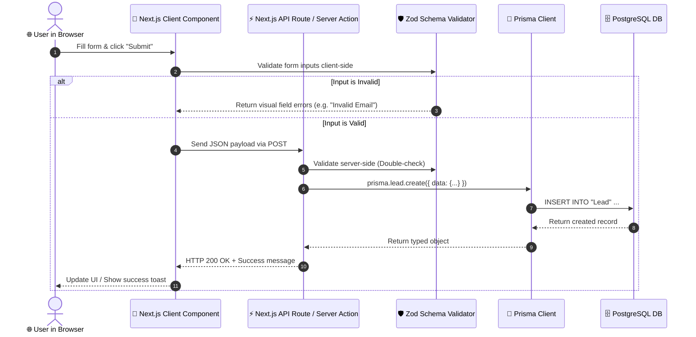

# 🧠 Understanding the Tech Stack & System Architecture

A plain-English guide to the technologies chosen for SunNFun Travel CRM and the logic behind each architectural choice.

---

## 🏗️ The Core Stack at a Glance

| Layer | Technology | Why we use it | Vibe Coder Takeaway |
|---|---|---|---|
| **Framework** | **Next.js 14 (App Router)** | Hybrid Server & Client rendering, built-in API routing, instant SEO and fast page loads. | All page routes live in `/app`. Folders become URLs! |
| **Language** | **TypeScript** | Catches errors before runtime, provides instant autocomplete in VS Code/Antigravity. | You don't have to guess object fields; TypeScript tells you. |
| **Styling** | **Tailwind CSS** | Utility classes directly inside JSX. Fast styling without jumping between CSS files. | Want a blue button with rounded corners? `className="bg-blue-600 rounded-lg text-white"`. |
| **UI Library** | **Shadcn UI** | Accessible, headless components you own directly in your codebase (`/components/ui`). | No bloated NPM package; clean code you can customize anytime. |
| **ORM** | **Prisma** | Type-safe database queries against PostgreSQL. Generates TypeScript types directly from models. | Say goodbye to writing raw SQL strings by hand. |
| **Database** | **PostgreSQL (Supabase)** | Relational database ideal for complex multi-tenant travel schemas (Trips, Quotes, Hotels, Ledgers). | Rock-solid data integrity with Foreign Keys and ACID transactions. |
| **Form & Validation** | **React Hook Form + Zod** | High performance forms without unnecessary re-renders, paired with schema validation. | Zod defines the rules (e.g. valid email, min length), Hook Form manages the inputs. |
| **CI / CD** | **GitHub Actions + Vercel** | Automated tests on pull request, automatic zero-downtime deployment on merge. | Safe pushes: broken code gets stopped before it hits production. |

---

## 🎨 How Shadcn UI + Tailwind Works Under the Hood

Unlike traditional component libraries (like MUI or Bootstrap) which bundle CSS in huge external packages, Shadcn UI uses **Copy-Paste Architecture**:

1. **Primitives**: Built on top of `@radix-ui` which handles accessibility, keyboard navigation, focus management, and screen-readers.
2. **Tokens**: Colors are defined in `app/globals.css` as HSL CSS variables:
   ```css
   :root {
     --primary: 221.2 83.2% 53.3%; /* Blue */
     --background: 0 0% 100%;       /* White */
   }
   ```
3. **Utility Function (`cn`)**:
   Located in `lib/utils.ts`, it combines `clsx` (for conditional classes) and `tailwind-merge` (to prevent CSS rule conflicts):
   ```tsx
   import { cn } from "@/lib/utils";

   <div className={cn("base-style", isSelected && "selected-style", customClass)} />
   ```

---

## 🗄️ Understanding Multi-Tenancy in Prisma

### What is Multi-Tenancy?
In our Travel CRM, multiple travel agencies (or DMCs) use the same platform. We must ensure that **Agency A can never see or touch Agency B's trips, quotes, or guest documents**.

### How we enforce it:
1. Every table (Trips, Quotes, Bookings, Customers) includes an `organization_id` column.
2. In upcoming Phase 0 tasks, a custom Prisma extension automatically injects `where: { organization_id: user.orgId }` into all queries.
3. If an agent queries `prisma.trip.findMany()`, the database query automatically becomes:
   ```sql
   SELECT * FROM "Trip" WHERE "organization_id" = 'user-current-org-id';
   ```

---

## 🛡️ The Life of a Request (From Click to Database)



---

## 💡 Summary for Vibe Coders

- **Frontend changes**: Look at `app/` and `components/`.
- **Styling changes**: Tweak classes in Tailwind or change theme tokens in `app/globals.css`.
- **Database changes**: Modify `prisma/schema.prisma`, then run `npx prisma validate` and `npx prisma migrate dev`.
- **API logic**: Lives in `app/api/` or Server Actions.
