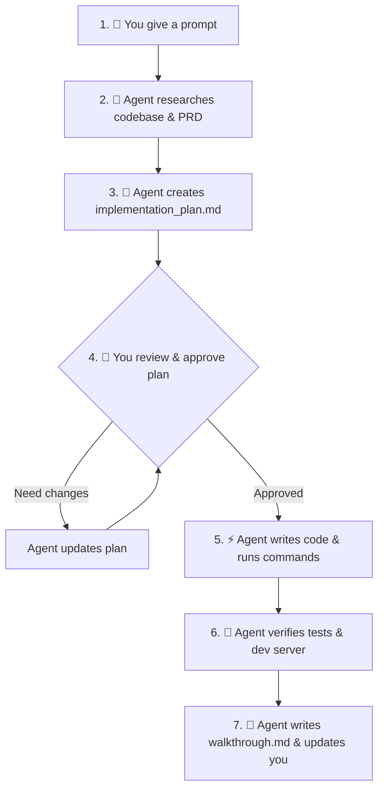

# 🤖 How to Vibe Code with Google Antigravity Agent

Learn how to get the most out of Antigravity Agent, review implementation plans, and automate full-stack workflows like a pro.

---

## 🎯 What is Antigravity?

Google Antigravity is an **agentic IDE**. Unlike simple AI autocomplete tools, Antigravity acts as an autonomous pair-programmer that can:
- Read your entire codebase and understand connections between files
- Plan multi-step architecture changes before writing code
- Run terminal commands directly (like installing packages, running builds, running linters)
- Inspect web pages with a browser agent
- Generate detailed artifacts (Implementation Plans, Walkthroughs, Code Diffs)

---

## 🧭 The Antigravity Development Cycle

---

## 🔑 Key Concepts You Should Know

### 1. Planning Mode vs Fast Mode
- **Planning Mode (Default & Recommended)**: For anything touching database schemas, auth, financial logic, or new feature architecture. Antigravity will **always** draft an `implementation_plan.md` first and wait for your green light.
- **Fast Mode**: For small fixes, cosmetic adjustments, or quick styling tweaks where you don't need a full plan beforehand.

### 2. Project Rules (`.agents/rules/sunnfuncrm.md`)
Antigravity reads the rules in `.agents/rules/` on **every single task**. This ensures the agent:
- Never substitutes the tech stack (e.g. keeps Next.js + Tailwind + Prisma + Postgres).
- Always scopes queries to `organization_id` for multi-tenancy.
- Never hard-deletes records (archives/merges instead).
- Uses `$transaction` for money-related mutations.

### 3. Artifacts (`implementation_plan.md` & `walkthrough.md`)
- **`implementation_plan.md`**: Shows what files will be created or edited, user review items, and how the changes will be tested.
- **`walkthrough.md`**: Summarizes the completed work and verification outputs after the task is finished.

---

## 🚀 Pro-Tips for Vibe Coders Giving Prompts

### ✅ DO:
- **Reference the PRD Part**: (e.g. *"Implement the Organization & User schema per PRD Part 1 Section A"*).
- **Specify constraints**: (e.g. *"Use Zod for input validation and include an Error Boundary"*).
- **Ask the agent to verify**: (e.g. *"Run npm run build and verify dev server starts cleanly before finishing"*).

### ❌ AVOID:
- Vague prompts like *"make the app"* or *"build the backend"*. Break large features into cohesive phases as mapped in `TravelCRM_Antigravity_Buildplan.md`.
- Manually copy-pasting code snippets back and forth — let the agent edit files directly using its filesystem tools!

---

## 🎓 Next Steps in the Build Journey

Now that you have reviewed the foundation, follow `TravelCRM_Antigravity_Buildplan.md` to proceed to:
- **Prompt B.1**: Organization, User & Auth Schema (PRD Part 1)
- **Prompt B.2**: Authentication Flows (Passkeys, 2FA, NextAuth)
- **Prompt B.3**: Organization Settings & Team Management UI
