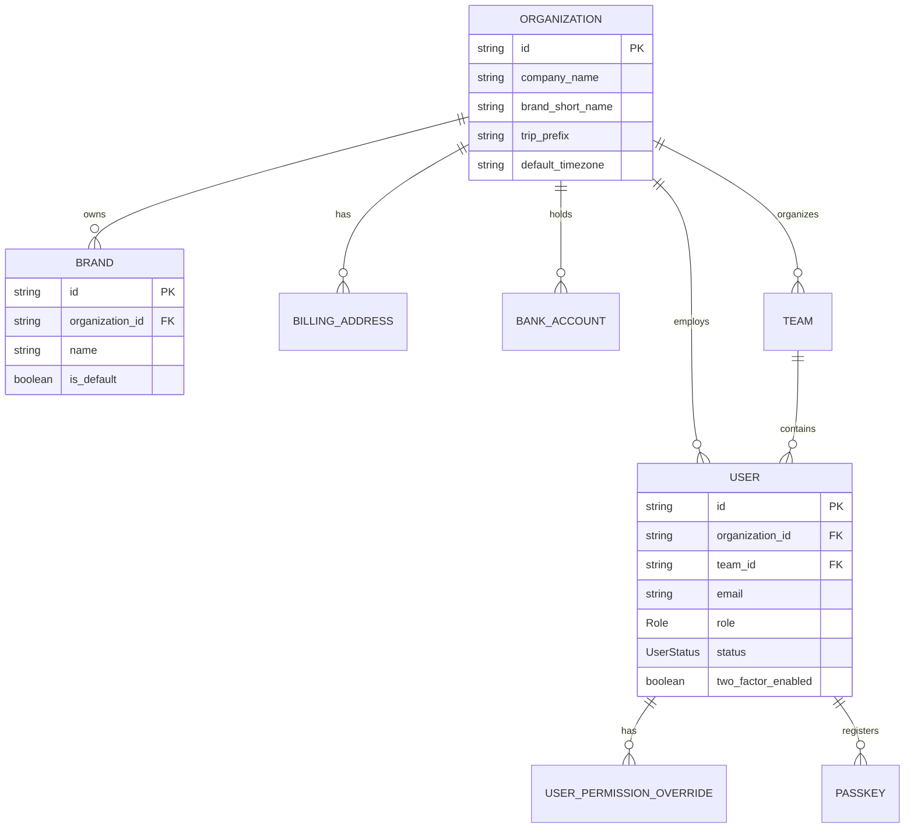
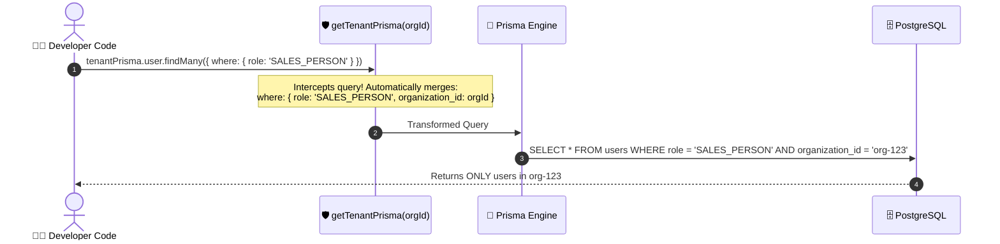

# 🏢 Step 2 (Phase 0 - B.1): Core Organization, User, & Multi-Tenant Scoping Schema

Welcome to Step 2 of the build journey! In this module, we implement the **core multi-tenant database foundation** and the **automatic query isolation engine**.

---

## 🎯 What We Built

1. **8 Core Data Models in Prisma**:
   - `Organization`: The root tenant container (DMC / Travel Agency).
   - `Brand`: Multi-branding support (e.g. B2B DMC brand vs B2C OTA brand).
   - `BillingAddress`: Company registered billing details and tax IDs.
   - `BankAccount`: Bank details for wire transfer quotations and invoices.
   - `User`: Team members with role-based access control (RBAC).
   - `Team`: Sub-teams (e.g. Domestic vs International sales teams).
   - `UserPermissionOverride`: Fine-grained permission grants/revocations per user.
   - `Passkey`: WebAuthn credentials for fast, passwordless biometric login.
2. **3 Role & Preference Enums**:
   - `Role`: `SUPER_ADMIN`, `ADMIN`, `SALES_HEAD`, `SALES_PERSON`, `OPERATIONS`, `RESERVATIONS`, `DATA_OPERATOR`, `ACCOUNTANT`.
   - `UserStatus`: `ACTIVE`, `DISABLED`.
   - `ThemePreference`: `LIGHT`, `DARK`.
3. **The Multi-Tenant Prisma Extension (`getTenantPrisma`)**:
   - Enforces structural tenant isolation by automatically injecting `organization_id` into all database reads, writes, and mutations.

---

## 🗺️ Visual Schema Relationship Diagram



---

## 🛡️ Deep Dive: How the Multi-Tenant Prisma Extension Works

In a SaaS application, a single missed `where: { organization_id: user.orgId }` filter could cause an agent to see another agency's private customer trips. To prevent this, we use **Prisma Client Extensions** (`prisma.$extends`).

### How `getTenantPrisma(orgId)` Protects Your Data



### Key Safety Rules in `lib/prisma.ts`:
1. **Find Many / Count**: Automatically appends `organization_id: orgId` to `args.where`.
2. **Create / CreateMany**: Automatically attaches `organization_id: orgId` to `args.data`.
3. **Find Unique**: Translates `findUnique` into a tenant-scoped `findFirst` to prevent unauthorized cross-tenant record lookup.
4. **Update / Delete**: Ensures mutations can never modify records belonging to a different tenant.

---

## 🧪 Verification & Testing

To test the multi-tenant query extension yourself, run:

```bash
# Validate Prisma schema
npx prisma validate

# Run the automated multi-tenancy verification script
npx tsx scripts/test-org-scoping.ts

# Run linter & TypeScript checks
npm run lint
npx tsc --noEmit
```

All checks should output green checkmarks! 🎉
