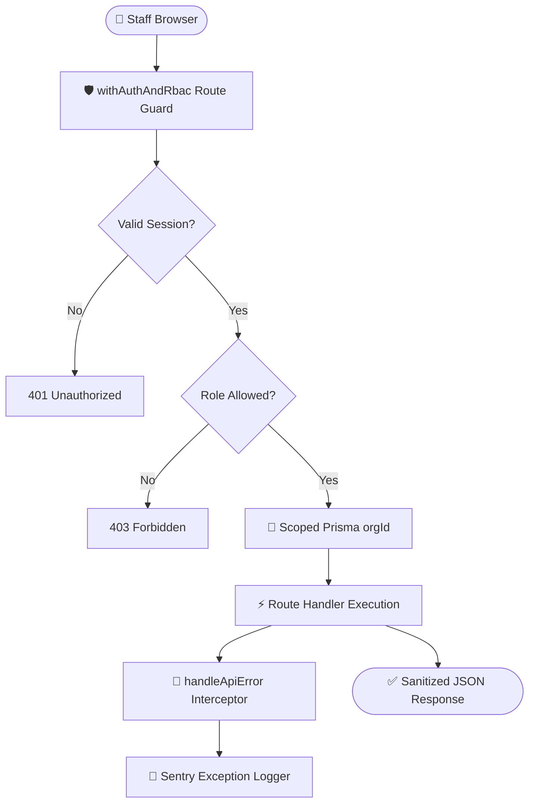

# 06. Phase 0, Task B.3 — Org Settings, User Management & Global Hardening

> **What was built in this milestone:**
> - Organization Settings Screen (tabbed: Profile, Users & Teams, Currencies preview)
> - Staff Management (Users Data Table with status green/red dot, Invite Member modal with temporary credentials generation)
> - Destination Teams Management panel
> - Centralized API Error Handler (`lib/api-error.ts` mapping 400, 401, 403, 404, 500)
> - Sentry application monitoring integration (`@sentry/nextjs`)
> - React `SettingsErrorBoundary` preventing localized UI failures from crashing the entire app
> - Complete End-to-End verification test suite (`scripts/test-phase0-full-flow.ts`)

---

## 🧠 System Architecture & Data Flow



---

## 📁 Files Created in This Phase

```
lib/
  api-error.ts                     ← Centralized AppError hierarchy & handleApiError()
  rbac.ts                          ← Updated to pipe errors through handleApiError()

app/api/org/
  settings/route.ts                ← GET / PUT /api/org/settings
  billing-address/route.ts         ← POST /api/org/billing-address
  bank-account/route.ts            ← POST /api/org/bank-account

app/api/users/
  route.ts                         ← GET /api/users (filters: status, role, team)
  invite/route.ts                  ← POST /api/users/invite (generates temp password)
  [id]/status/route.ts             ← PUT /api/users/:id/status (activate/disable)
  [id]/permissions/route.ts        ← PUT /api/users/:id/permissions (override permissions)

app/api/teams/
  route.ts                         ← GET / POST /api/teams
  [id]/members/route.ts            ← PUT /api/teams/:id/members

components/
  providers/QueryProvider.tsx      ← TanStack React Query client provider
  settings/
    SettingsErrorBoundary.tsx      ← Class Error Boundary with retry
    UsersTable.tsx                 ← Member list with status indicator & role badges
    InviteMemberDialog.tsx         ← Modal to invite staff and copy temp password
    TeamsPanel.tsx                 ← Team grouping & destination scope management

app/(dashboard)/
  layout.tsx                       ← Authenticated dashboard layout with sidebar
  dashboard/page.tsx               ← Main welcome dashboard
  settings/page.tsx                ← Tabbed Organization Settings UI

sentry.*.config.ts                 ← Client, Server, Edge monitoring configurations
scripts/test-phase0-full-flow.ts   ← Comprehensive E2E verification test
```

---

## 👥 How User Invitation & RBAC Scoping Works

1. **Admin Invites User**:
   - Admin opens `/settings` → Users tab → "Invite Member".
   - Selects Role (e.g. `SALES_PERSON`), enters Name & Email.
   - Server creates user in PostgreSQL (`status: ACTIVE`) and generates a 12-char secure temporary password (e.g. `Temp@a9f4c3b2`).
   - Admin copies credentials to relay to the staff member.

2. **Staff Logs In**:
   - Staff navigates to `/login` and enters temporary credentials.
   - `POST /api/auth/login` verifies bcrypt hash, generates HttpOnly JWT cookie containing user details and `organization_id`.

3. **RBAC Protection**:
   - If `SALES_PERSON` attempts to access `PUT /api/org/settings`, `withAuthAndRbac` evaluates the role allowlist (`["SUPER_ADMIN", "ADMIN"]`) and returns:
     ```json
     { "error": "Forbidden: Role 'SALES_PERSON' lacks permission for this action." }
     ```
   - When querying quotes or trips, the extension injects `where: { organization_id, assigned_user_id: user.id }`.

---

## 🛡️ Centralized Error Handling Hierarchy

`lib/api-error.ts` standardizes all error responses across the application per PRD Part 8 Section D:

| Error Type | HTTP Status | Response Shape |
|---|---|---|
| `ZodError` | `400 Bad Request` | `{ "error": "Validation failed", "details": { ... } }` |
| `UnauthorizedError` | `401 Unauthorized` | `{ "error": "Active session required." }` |
| `ForbiddenError` | `403 Forbidden` | `{ "error": "Forbidden: Insufficient permissions" }` |
| `NotFoundError` | `404 Not Found` | `{ "error": "Resource not found" }` |
| Unhandled Exceptions | `500 Server Error` | `{ "error": "Internal server error" }` |

---

## ⚡ Vibe Coder Cheat Sheet

```bash
# 1. Run full Phase 0 E2E verification suite
npx tsx scripts/test-phase0-full-flow.ts

# 2. Typecheck entire repository
npx tsc --noEmit

# 3. Lint check
npm run lint

# 4. Start local development server
npm run dev
# -> Open http://localhost:3000/login
# -> Login with superadmin@sunnfun.test / Admin@1234
# -> Navigate to Settings: http://localhost:3000/settings
```

---

## 🎉 Phase 0 Complete

Phase 0 (Foundation, Security, Multi-Tenancy & Auth Core) is now 100% finished. All foundation systems are in place for Phase 1.
