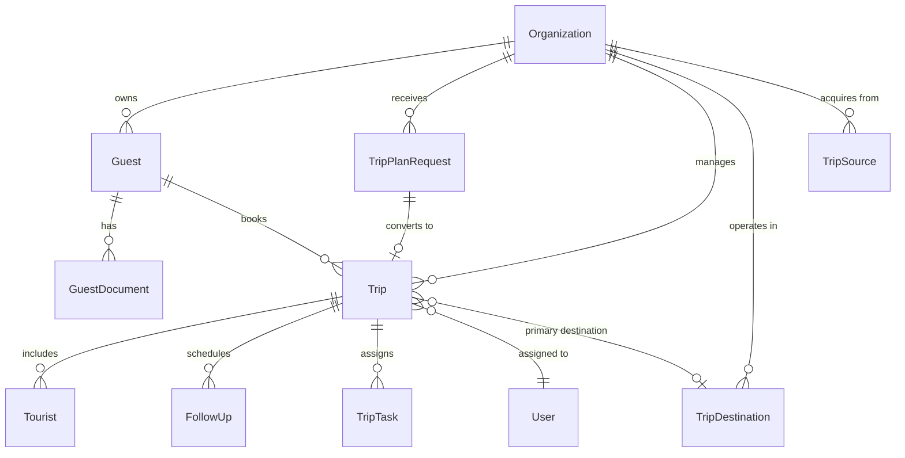
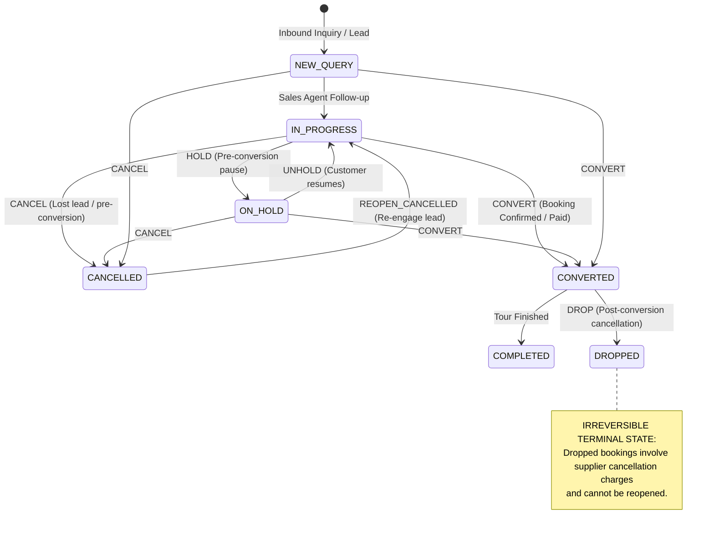

# 07. Phase 1 — CRM Core Schema, Display ID Generation & Trip Lifecycle State Machine

> **What was built in this milestone:**
> - Complete Prisma schema implementation for PRD Part 2: `Guest`, `GuestDocument`, `TripPlanRequest`, `Trip`, `Tourist`, `FollowUp`, `TripTask`, `TripDestination`, `TripSource`
> - Sequential, tenant-scoped `trip_display_id` generation engine (`lib/trip-id.ts`)
> - Sembark-parity Trip Lifecycle State Machine (`lib/trip-lifecycle.ts`) modeling distinct `HOLD`, `CANCEL` (revertible pre-conversion), and `DROP` (irreversible post-conversion) guards
> - Automated multi-tenant Prisma scoping extension update (`lib/prisma.ts`)
> - Verification test suite (`scripts/test-phase1-schema-and-lifecycle.ts`)

---

## 🏗️ PRD Part 2 Entity Relationship Architecture



---

## 🔄 The Sembark Trip Lifecycle State Machine

A critical design requirement in Sembark-parity CRM architecture is that **Hold**, **Cancel**, and **Drop** are **not** interchangeable enum clicks — they represent fundamentally different business workflows:



---

## 📋 State Transition Rules Reference

| Current Status | Target Action | Resulting Status | Rules & Guard Conditions |
|---|---|---|---|
| `NEW_QUERY` / `IN_PROGRESS` | `HOLD` | `ON_HOLD` | Temporarily freezes follow-up SLA clock while client considers. |
| `ON_HOLD` | `UNHOLD` | `IN_PROGRESS` | Resumes active sales progression. |
| `NEW_QUERY` / `IN_PROGRESS` / `ON_HOLD` | `CANCEL` | `CANCELLED` | Pre-conversion cancellation (client opted out before paying). |
| `CANCELLED` | `REOPEN_CANCELLED` | `IN_PROGRESS` | **Revertible**: client returns weeks later asking to resume inquiry. |
| `CONVERTED` | `DROP` | `DROPPED` | **Irreversible**: post-conversion drop involving financial/supplier penalties. |
| `NEW_QUERY` / `IN_PROGRESS` / `ON_HOLD` | `CONVERT` | `CONVERTED` | Booking deposit received; locks pricing into operational vouchers. |
| `CONVERTED` | `COMPLETE` | `COMPLETED` | Tour successfully executed. |
| *Any Status* | `LOCK` / `UNLOCK` | *Unchanged* | **Admin/Super Admin only**: prevents accidental edits to past/billed trips. |

---

## 🏷️ Sequential `trip_display_id` Generation

In `lib/trip-id.ts`, IDs are constructed from `Organization.trip_prefix` + atomic sequence counter:
- Default: `SBC-10001`, `SBC-10002`, ...
- Custom Brand Override: e.g. `NEP-50001`
- Unique constraint: `@@unique([organization_id, sequence_number])` guarantees no duplicate IDs even under concurrent lead creation.

---

## ⚡ Vibe Coder Cheat Sheet

```bash
# 1. Validate Prisma schema
npx prisma validate

# 2. Run lifecycle state machine & display ID test suite
npx tsx scripts/test-phase1-schema-and-lifecycle.ts

# 3. TypeScript compilation & Lint check
npx tsc --noEmit
npm run lint
```
