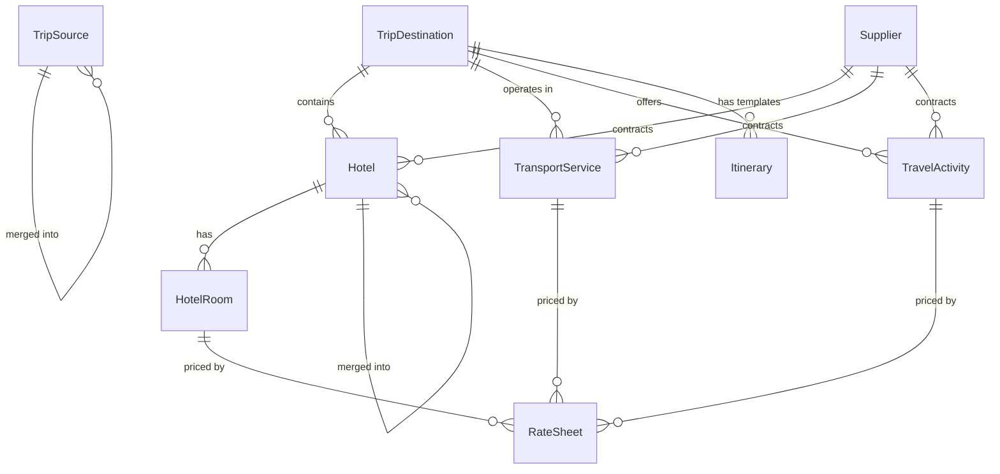
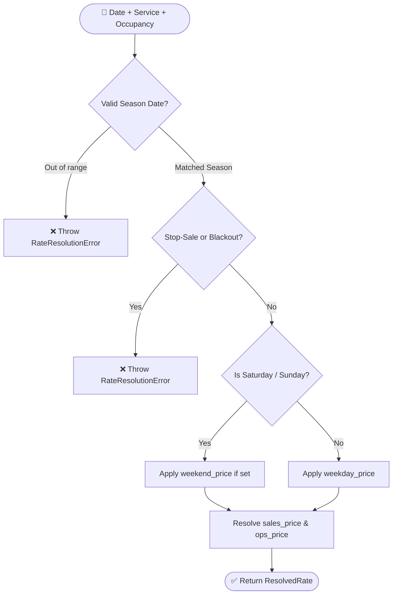

# 08. Phase 1 — Master Data, Seasonal Rate Resolution & Bulk Import Conventions

> **What was built in this milestone:**
> - Full Master Data schema: `TripDestination`, `Supplier`, `Hotel`, `HotelRoom`, `RateSheet`, `TransportService`, `TravelActivity`, `Itinerary`, `TripSource`
> - Seasonal **Rate Resolution Engine** (`lib/rate-resolution.ts`) with hard-fail guarantees (stopsale, blackout dates, weekend pricing, sales/ops split)
> - **Sembark Cell Convention Bulk Import Parser** (`lib/bulk-import-parser.ts`) supporting room-count/occupancy suffixes, vendor double-brackets, and sales/ops columns
> - Sample XLSX template generation endpoint (`GET /api/inventory/hotels/download-template`)
> - Hotel and Trip Source **Merge** endpoints (`POST /api/inventory/hotels/:id/merge`, `POST /api/trip-sources/:id/merge`) ensuring historical records are never hard-deleted
> - Automated test suite (`scripts/test-phase1-master-data-and-rates.ts`)

---

## 🏗️ Master Data Entity Model



---

## 📊 Sembark-Parity Cell Conventions Reference

When importing master rate sheets from Excel / CSV, the parser recognizes three plain-text conventions:

| Convention Pattern | Example in Sheet | Parser Extraction |
|---|---|---|
| **Room & Occupancy Suffixes** | `Deluxe Room (40R)(2P)` | Room: `Deluxe Room`<br>Inventory: `40 Rooms`<br>Max Pax: `2 Persons` |
| **Vendor Tagging (Double Bracket)** | `Hotel Yak & Yeti [[HIMALAYAN DMC]]` | Hotel: `Hotel Yak & Yeti`<br>Contracted Supplier: `HIMALAYAN DMC` |
| **Sales vs. Ops Column Suffixes** | `Autumn Peak (Sales)` / `Autumn Peak (Ops)` | Maps to separate client selling price vs. operator cost price on the same rate sheet row |

---

## ⏱️ Rate Resolution Pipeline

The pricing engine resolves prices deterministically without silent fallbacks:



> **Why Hard-Fail?**  
> Sembark's comparative marketing explicitly calls out the risk of sales agents quoting off-season rates for peak-season queries. The rate resolution engine **hard-fails with a 422 error** if no active rate sheet covers the requested dates.

---

## 🔗 Merge (Never Delete) Architecture

Per PRD Part 3 Technical Constraints:
- Historical quotes and past bookings hold foreign keys to master data.
- Deleting a hotel or source breaks past financial reports.
- Duplicates are merged via `POST /api/inventory/hotels/:id/merge` (`{ mergeIntoId }`):
  - Migrates all `HotelRoom` records to the primary hotel.
  - Sets `is_archived = true` and `merged_into_id = mergeIntoId` on the duplicate.

---

## ⚡ Vibe Coder Cheat Sheet

```bash
# 1. Download sample import template
curl -O http://localhost:3000/api/inventory/hotels/download-template

# 2. Run master data & rate engine test suite
npx tsx scripts/test-phase1-master-data-and-rates.ts

# 3. Validate Prisma schema & run typecheck
npx prisma validate
npx tsc --noEmit
npm run lint
```
