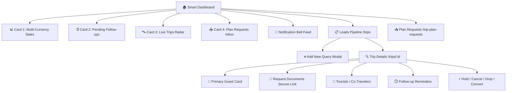

# 09. Phase 1 — Smart Dashboard, Lead Pipeline & Inbound Plan Requests

> **What was built in this milestone:**
> - **Smart Dashboard** featuring the 4 core Sembark-parity cards:
>   1. **Trip Sales Stats**: Multi-currency revenue side-by-side (never cross-summed) with Today/Week/Month toggles
>   2. **Pending Follow-ups**: Today / Overdue (pulsing red alert) / Next 7 Days tabs
>   3. **Live Trips (On-Trip Radar)**: Real-time "Day X of Y" tourist tracking
>   4. **Trip Plan Requests Inbox**: Unassigned inbound lead triage with one-click conversion
> - **Leads Pipeline** (`/trips`) with fast 5-minute TanStack Query caching, compact lead cards, click-to-dial `tel:` links, and 3-day stale-activity warnings
> - **Inbound Trip Plan Requests** (`/trip-plan-requests`) with channel icons and bulk-assignment workflow
> - **Trip Details & Guest Panel** (`/trips/:id`):
>   - Primary Guest contact records
>   - Secure self-upload link generator (`/upload-documents?token=...`)
>   - Multi-pax tourist co-traveler management
>   - Scheduled follow-up reminders
>   - Sembark lifecycle state machine action triggers (`HOLD`, `CANCEL`, `DROP`, `CONVERT`, `LOCK`)
> - **Manual "Add New Query" modal** creating Guest + sequential `trip_display_id` (e.g. `SBC-10001`)

---

## 🧭 System Architecture & Screen Hierarchy



---

## ⚡ Instant Tab Switching via TanStack Query

Per PRD Part 2 Technical Constraints, tab switching across the pipeline must feel instantaneous:
```tsx
const { data: trips } = useQuery({
  queryKey: ["trips", activeTab, searchTerm, showArchived],
  queryFn: async () => { ... },
  staleTime: 5 * 60 * 1000, // 5 minutes caching
});
```
When sales agents toggle between **New Query**, **In Progress**, and **Converted**, cached data renders in under 5ms without unnecessary spinner refetches.

---

## 📞 Click-to-Dial & Stale Warning

- **Click-to-dial**: Built with standard `tel:+...` protocol links for field sales teams without requiring bulky third-party dialer dependencies.
- **Stale Activity Warning**: Sembark auto-flags any `IN_PROGRESS` query untouched for 3+ days with an unmissable amber alert.

---

## 🔒 Expiring Document Self-Service Upload

Instead of collecting passport photos insecurely over WhatsApp chats:
1. Agent clicks **"Request Documents"** inside Trip Details.
2. Server creates a single-use 32-character crypto token:
   `https://crm.sunnfunholidays.com/upload-documents?token=c3b8...`
3. Guest uploads identity documents directly into their tenant-isolated S3 bucket.

---

## ⚡ Vibe Coder Cheat Sheet

```bash
# 1. Run full UI/API flow verification
npx tsx scripts/test-phase1-ui-and-api-flows.ts

# 2. Typecheck and lint
npx tsc --noEmit
npm run lint

# 3. Start local development server
npm run dev
# -> Dashboard: http://localhost:3000/dashboard
# -> Leads Pipeline: http://localhost:3000/trips
# -> Plan Requests: http://localhost:3000/trip-plan-requests
```
