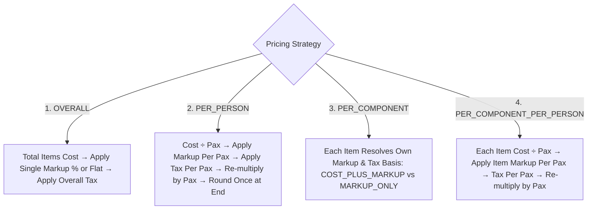
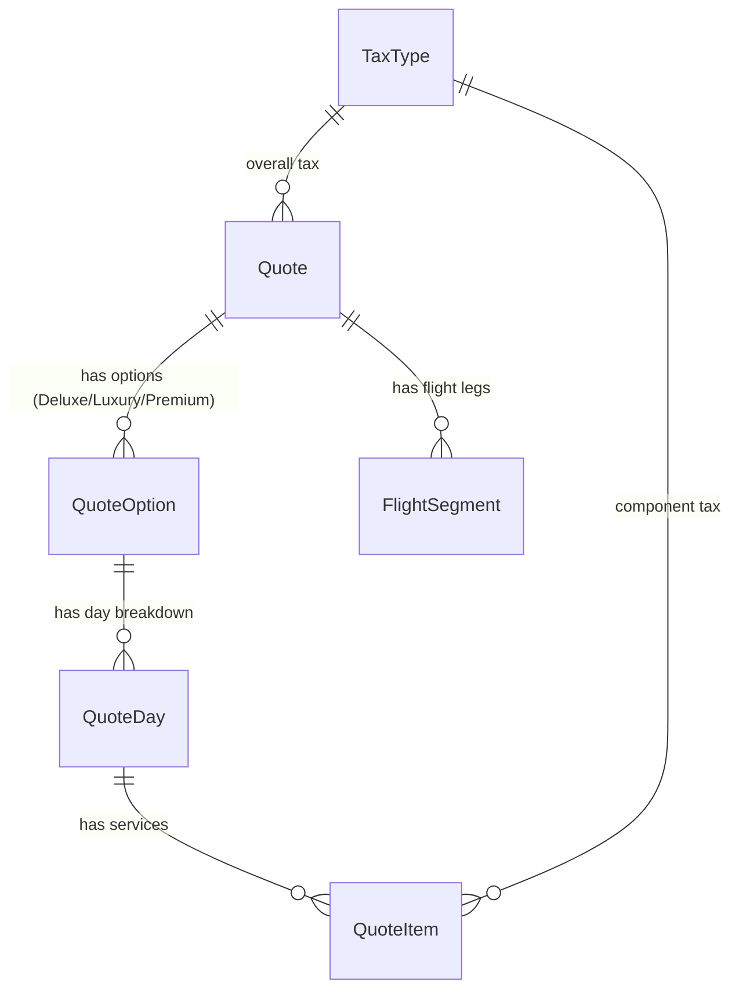

# 10. Phase 1 — Quotation Schema, Financial Pricing Engine & 4 Strategies

> **What was built in this milestone:**
> - Full database schema for **Quotation & Itinerary Building** (`Quote`, `QuoteOption`, `QuoteDay`, `QuoteItem`, `FlightSegment`, `TaxType`, `QuoteTemplate`)
> - Pure **Quotation Pricing Calculation Engine** (`lib/quote-pricing.ts`) implementing Sembark's 4 core pricing strategies
> - Strict **Single Final Rounding Rule** to prevent off-by-one-cent rounding drift
> - **Flight Segment Validation** enforcing both `cost_price` and `selling_price` presence before rendering
> - **Free-of-Cost (FOC)** item handling (zeroes selling price while preserving cost for margin calculation)
> - **Unit test suite** (`scripts/test-phase1-quote-pricing.ts`) verifying all 4 pricing strategies against hand-calculated totals

---

## 🧮 Sembark-Parity 4 Pricing Strategies



### 1. Overall
- Computes single markup across non-FOC itinerary services and applies overall tax rate.
- Perfect for standard flat-margin vacation packages.

### 2. Per-Person
- Divides total non-FOC cost by total travelers (`pax_adults + pax_children`).
- Adds per-person flat or percentage markup and tax.
- **Critical Rule:** Multiplies back by `pax` in full precision before applying `roundToCent()`, avoiding cumulative rounding drift.

### 3. Per-Component
- Every single service row (`QuoteItem`) configures its own `markup_type` (`PERCENT` or `FLAT`), `markup_value`, and `tax_basis`:
  - **`COST_PLUS_MARKUP`**: Tax applies to `(Cost + Markup)`.
  - **`MARKUP_ONLY`**: Tax applies strictly to `Markup` (standard DMC commission tax model).

### 4. Per-Component Per-Person
- Calculates service-level markups and taxes on a per-traveler basis before consolidating into total quote figures.

---

## ✈️ Flight Segment Validation

Per PRD Part 4 and Sembark documentation:
- If a flight segment is entered with either `cost_price` or `selling_price` missing (`null`), it is **strictly excluded** from quote output totals and display.
- Prevents embarrassing $0 flights from leaking onto client itineraries.

---

## ⚡ Multi-Option Tier Architecture



A single `Quote` can contain multiple `QuoteOption` records (e.g. "Standard 3-Star", "Deluxe 4-Star", "Luxury 5-Star"), allowing clients to choose their accommodation tier in a single shareable link without rebuilding itineraries.

---

## ⚡ Vibe Coder Cheat Sheet

```bash
# 1. Run Quote Pricing Unit Tests
npx tsx scripts/test-phase1-quote-pricing.ts

# 2. Validate Prisma Schema & TypeScript Types
npx prisma validate
npx tsc --noEmit
npm run lint
```
