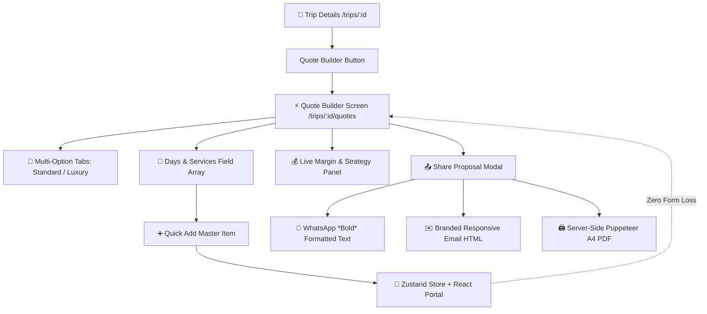

# 11. Phase 1 — Quote Builder UI, Multi-Option Tiers, Quick Add & Puppeteer PDF

> **What was built in this milestone (Completing Phase 1):**
> - **Dynamic Quote Builder UI** (`components/quotes/QuoteBuilder.tsx`): `react-hook-form` + `useFieldArray` managing day-by-day services and co-traveler itinerary flows
> - **Isolated Quick Add Modal** (`components/quotes/QuickAddModal.tsx` & `stores/quickAddStore.ts`): React Portal + independent Zustand store guaranteeing zero form state loss when creating inventory on the fly
> - **Multi-Option Tiers**: Single shareable quote hosting multiple accommodation/transport options (Standard / Deluxe / Luxury)
> - **Live Pricing & Markup Panel** (`components/quotes/PricingMarkupPanel.tsx`): Real-time profit margin calculations across all 4 Sembark pricing strategies
> - **Server-Side Puppeteer PDF Generation** (`lib/pdf-generator.ts` & `POST /api/quotes/:id/generate-pdf`): Branded & Unbranded vector A4 PDF export
> - **Share Package Modal** (`components/quotes/SharePackageModal.tsx`): WhatsApp text export (with `*bold*` formatting and `wa.me` links), Email HTML preview, and PDF download toggles

---

## 🎨 Architecture & Component Hierarchy



---

## 🛡️ Quick Add State-Preservation Contract

A critical UX requirement in Sembark is that typing extensive notes and rates into Day 4 must **never be lost** if a sales agent needs to create a missing hotel on-the-fly:
1. When **"+ Hotel"** is clicked, the parent form does not unmount.
2. `useQuickAddStore` opens the modal via React Portal.
3. Once the master record is created, the callback injects the new service into the active day's `items` array.
4. The parent form's uncommitted field values remain completely untouched.

---

## 🖨️ Server-Side PDF vs. Client-Side Libraries

PRD Part 4 strictly forbids client-side PDF libraries (`jspdf`/`html2canvas`) because:
- Client-side DOM canvas capture slices text in half across page breaks.
- Font rendering depends on client OS rather than the DMC's branding.
- Puppeteer renders headless Chromium server-side, guaranteeing identical vector typography, headers, footers, and margins everywhere.

---

## ⚡ Vibe Coder Cheat Sheet

```bash
# 1. Run full quote builder & PDF test suite
npx tsx scripts/test-phase1-quote-builder-full-flow.ts

# 2. Typecheck and lint
npx tsc --noEmit
npm run lint

# 3. Test in browser:
# -> Open Trip Details: http://localhost:3000/trips
# -> Click "Quote Builder" -> Build 3-day multi-option proposal
# -> Click "Share Proposal" -> Download PDF / Open WhatsApp
```
