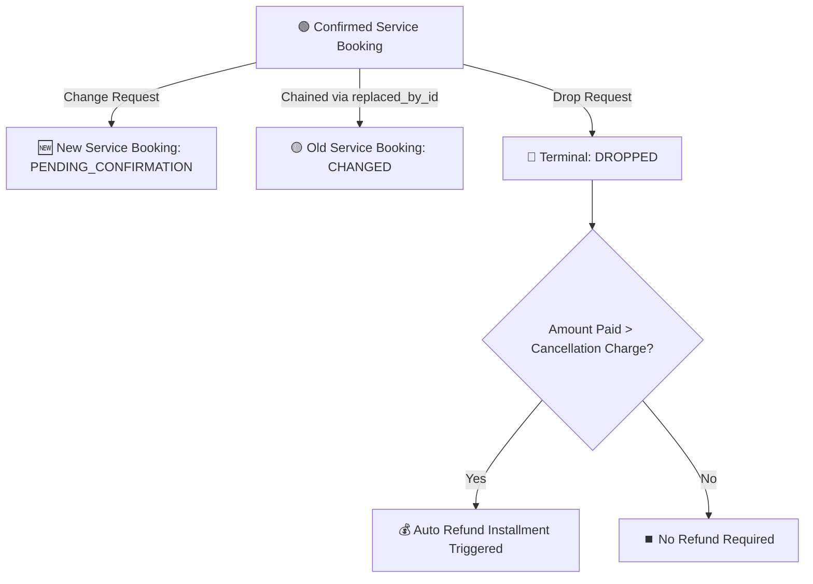

# 12. Phase 2 — Operations, Service Bookings, Change vs. Drop & Dispatch Schema

> **What was built in this milestone:**
> - **Operational Schema (PRD Part 5)** (`prisma/schema.prisma`): `ServiceBooking`, `DispatchAssignment`, `Voucher` models and `ServiceBookingStatus` & `VoucherType` enums.
> - **Change vs. Drop Non-Overwriting Logic** (`POST /api/service-bookings/:id/change` & `POST /api/service-bookings/:id/drop`):
>   - **Change**: Creates a new `ServiceBooking` linked via `replaced_by_service_booking_id` and marks the old one `CHANGED`. Cost history is 100% queryable.
>   - **Drop**: Terminal operation with `drop_cancellation_charge` and automatic refund-installment check against `amount_paid`.
> - **Unified-Subject Hotel Booking Enquiry** (`POST /api/service-bookings/:id/send-enquiry`): Pre-fills guest, room count, dates, and meal plan with unified subject line: `[Booking Enquiry] {TripDisplayID} - {GuestName} - {RoomCount} Room(s) ({CheckIn} to {CheckOut}) - {BrandName}`.
> - **Self-Booked Accommodations** (`POST /api/service-bookings/self-booked`): Enables tracking client-booked hotels on master itineraries/vouchers with zero internal supplier liability (`cost_price: 0`).

---

## 🏗️ State Transitions: Change vs. Drop



---

## ⚡ Vibe Coder Cheat Sheet

```bash
# 1. Run Part 5 Operations & Service Bookings test suite
npx tsx scripts/test-phase2-part5-operations-and-service-bookings.ts

# 2. Verify Multi-Tenancy & Regression
npx tsx scripts/test-phase1-regression-suite.ts

# 3. Typecheck and lint
npx tsc --noEmit
npm run lint
```
