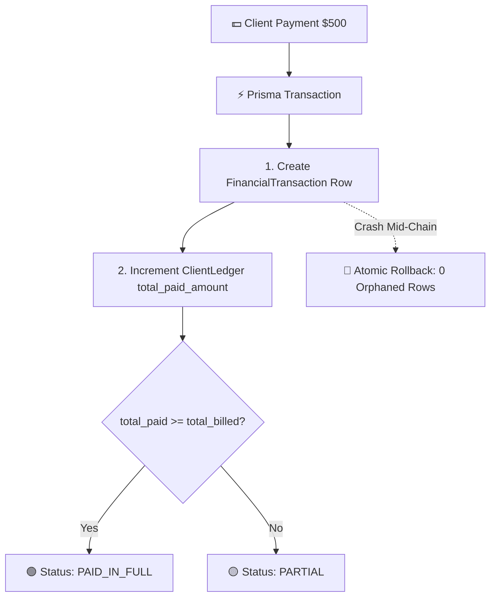
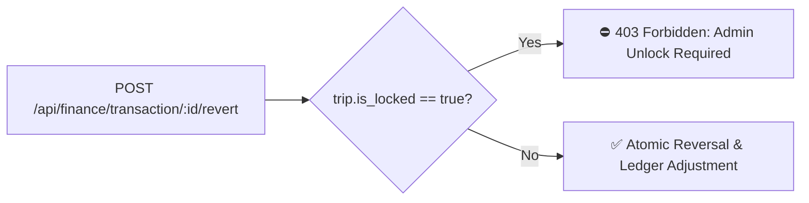

# 14. Phase 2 — Financial Accounting, Atomic Ledgers & Locked-Trip Revert Guards

> **What was built in this milestone:**
> - **Financial Accounting Schema (PRD Part 6)** (`prisma/schema.prisma`): `Account`, `ClientLedger`, `SupplierLedger`, `FinancialTransaction`, `PaymentPreferenceRule`, `ProformaInvoice`, `PaymentGatewayTransaction` models and respective enums.
> - **Atomic $transaction Payment Logging** (`lib/finance-service.ts` & `POST /api/finance/transaction/client`, `POST /api/finance/transaction/supplier`):
>   - Inserts `FinancialTransaction`
>   - Increments `ClientLedger`/`SupplierLedger` `total_paid_amount`
>   - Automatically updates status (`UNPAID` → `PARTIAL` → `PAID_IN_FULL`)
>   - Rollback guarantee: any mid-chain crash rolls back 100%, resulting in **zero orphaned rows**.
> - **Server-Side Locked-Trip Revert Guard** (`POST /api/finance/transaction/:id/revert`):
>   - Blocks financial reversal on locked trips with `403 Forbidden` (`trip.is_locked === true`), matching Sembark's strict accounting controls.
> - **Part 5 Drop-Triggered Refund Installment Wiring**:
>   - Service Booking drop action automatically evaluates `amount_paid` vs `drop_cancellation_charge` and posts an auto-generated refund installment transaction to the `ClientLedger`.

---

## 💰 Atomic Payment State Machine



---

## 🔒 Locked-Trip Security Architecture



---

## ⚡ Vibe Coder Cheat Sheet

```bash
# 1. Run ACID transactions & locked-trip test suite
npx tsx scripts/test-phase2-finance-ledger-and-atomic-transactions.ts

# 2. Run full regression battery across all phases
npx tsx scripts/test-phase1-regression-suite.ts

# 3. Typecheck and lint
npx tsc --noEmit
npm run lint
```
