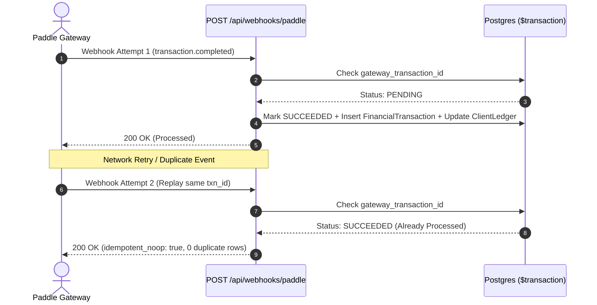

# 15. Phase 2 — Proforma Invoices, Paddle Webhook Idempotency & Financial Reports

> **What was built in this milestone:**
> - **Incoming & Outgoing Payments Dashboard** (`app/(dashboard)/finance/payments/page.tsx`, `components/finance/IncomingPaymentsTable.tsx`):
>   - Filters: `Past 7 Days`, `Today`, `Upcoming`, `Overdue`, `Paid in Full`.
>   - Dynamic date-diff badges using `date-fns` `formatDistanceToNowStrict` (*"Due in 2 days"*, *"Overdue by 5 days"*).
>   - Client-side CSV/Excel export for accountants and auditing.
> - **"Log Payment" Modal** (`components/finance/LogPaymentModal.tsx`):
>   - Pre-fills remaining balance, supports partial collections, and allows updating next due date on the fly.
> - **Proforma Invoice Auto-Filling** (`POST /api/trips/:id/proforma-invoice`):
>   - Auto-fills buyer/GST details from `TripSource` or guest profile.
>   - Generates categorized line items (Hotel, Transport, Activity, Flight).
> - **Paddle Hosted Payment Links & Idempotent Webhook** (`POST /api/finance/payment-links` & `POST /api/webhooks/paddle`):
>   - Idempotency guard by `gateway_transaction_id`: replaying a webhook event returns `idempotent_noop: true` with zero duplicate ledger postings.
> - **Sales & Profit Reports with Operations Warning Banner** (`app/(dashboard)/reports/page.tsx` & `GET /api/reports/profit-checkout`):
>   - Calculates real profit: $\text{Gross Profit} = \text{Selling Price} - \sum \text{Cost Price}$.
>   - Surfaces **`⚠️ Notice: Operations Pending Confirmation`** banner when any linked `ServiceBooking` is unconfirmed, avoiding false-precision reporting.

---

## 🔁 Webhook Idempotency State Machine



---

## ⚡ Vibe Coder Cheat Sheet

```bash
# 1. Run full-flow & webhook idempotency test suite
npx tsx scripts/test-phase2-full-flow.ts

# 2. Typecheck & lint
npx tsc --noEmit
npm run lint

# 3. View UI:
# -> Payments Dashboard: http://localhost:3000/finance/payments
# -> Profit & Sales Reports: http://localhost:3000/reports
```
