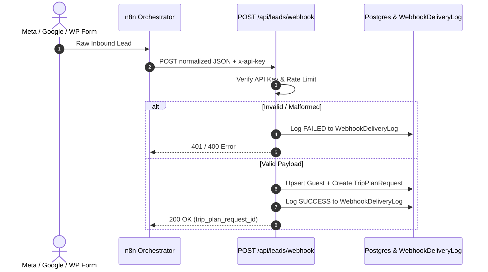

# 16. Phase 3 — Integrations, Omnichannel Leads Webhook & Notify Engine

> **What was built in this milestone:**
> - **Schema & Multi-Tenancy (PRD Part 7)** (`prisma/schema.prisma`): `IntegrationConnection`, `NotifyRule`, `WebhookDeliveryLog`, `EmailThread` registered in `TENANT_SCOPED_MODELS`.
> - **Public Lead Ingestion Webhook** (`POST /api/leads/webhook`):
>   - Protected by `IntegrationConnection` API key (`x-api-key` header or query string).
>   - Rate-limited via sliding window token bucket (`lib/rate-limiter.ts`).
>   - Zod-validated against normalized shape: `{ source, guest_name, phone, email, destination_text, ... }`.
>   - Auto-finds/creates `Guest` and generates `TripPlanRequest` in the unassigned or auto-distributed pipeline.
>   - **100% Audit Logging**: Every attempt (200 success, 400 bad request, 401 unauthorized, 429 rate limit) is logged to `WebhookDeliveryLog`.
> - **Notify Trigger Points & Dispatcher** (`lib/notify-dispatcher.ts` & `POST /api/notify/emit-due-reminders`):
>   - Emits lightweight events on `ServiceBooking` status transitions (`BOOKING_CONFIRMED`, `VOUCHER_GENERATED`) and `ClientLedger` 48-hour due-date approaching conditions (`PAYMENT_DUE_REMINDER`).
>   - Formats payload for external **n8n** webhook orchestration.
> - **Meta WhatsApp Webhook Listener** (`app/api/webhooks/whatsapp/route.ts`):
>   - `GET`: Handles Meta challenge handshake verification.
>   - `POST`: Parses delivery lifecycle updates (`sent`, `delivered`, `read`, `failed`) and persists them to `WebhookDeliveryLog`.

---

## ⚡ Omnichannel Lead Pipeline



---

## ⚡ Vibe Coder Cheat Sheet

```bash
# 1. Run Part 7 Integrations & Notify test suite
npx tsx scripts/test-phase3-part7-integrations-and-notify.ts

# 2. Typecheck and lint
npx tsc --noEmit
npm run lint

# 3. Simulate Lead Webhook:
curl -X POST http://localhost:3000/api/leads/webhook \
  -H "Content-Type: application/json" \
  -H "x-api-key: your-integration-api-key" \
  -d '{
    "source": "WEBSITE_FORM",
    "guest_name": "Sarah Jenkins",
    "phone": "+447911123456",
    "email": "sarah@example.com",
    "destination_text": "Everest Base Camp",
    "pax": 2
  }'
```
