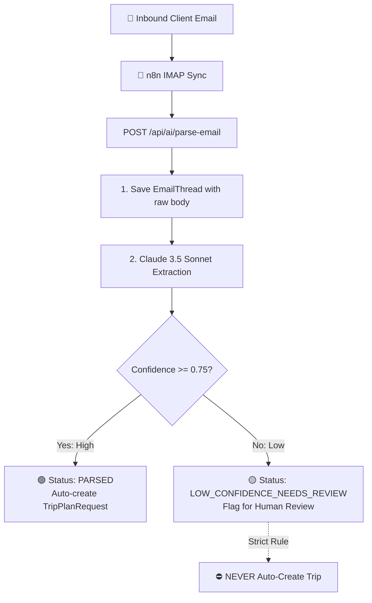

# 17. Phase 3 — AI Email Parsing, Schema Extraction & Confidence Branching

> **What was built in this milestone:**
> - **EmailThread Schema** (`prisma/schema.prisma`): Preserves original raw email text, sender, subject, confidence score, and extracted structured fields.
> - **Internal AI Parse Endpoint** (`POST /api/ai/parse-email` & `lib/ai-email-parser.ts`):
>   - Designed for external **n8n** IMAP orchestrator workflows.
>   - Executes Claude/LLM schema-constrained prompt extracting `{ guest_name, phone, email, destination, dates, pax, budget_hint, confidence_score }`.
> - **Strict Confidence-Threshold Branching**:
>   - **High Confidence ($\ge \text{threshold}$)**: Auto-creates a `TripPlanRequest` linked to the email thread and sets status to `PARSED`.
>   - **Low Confidence ($< \text{threshold}$)**: Flags status as `LOW_CONFIDENCE_NEEDS_REVIEW` and routes to the human Trip Plan Requests inbox.
>   - **CRITICAL TECHNICAL CONSTRAINT**: Low-confidence extraction **never** auto-converts to a `Trip`.
>   - **Raw Email Body Preservation**: The original unedited email text is always preserved in `EmailThread.body_text`.

---

## 🤖 AI Email Triage Architecture



---

## ⚡ Vibe Coder Cheat Sheet

```bash
# 1. Run AI email parsing test suite
npx tsx scripts/test-phase3-ai-email-parsing.ts

# 2. Typecheck and lint
npx tsc --noEmit
npm run lint

# 3. Simulate AI Parse Endpoint:
curl -X POST http://localhost:3000/api/ai/parse-email \
  -H "Content-Type: application/json" \
  -d '{
    "organization_id": "your-org-id",
    "from_address": "robert@example.com",
    "subject": "Nepal Trip for 4 pax in October",
    "body_text": "Hi, Name: Robert Vance. Phone: +1 415-555-2671. We want 7-day Kathmandu-Pokhara tour for 4 pax."
  }'
```
