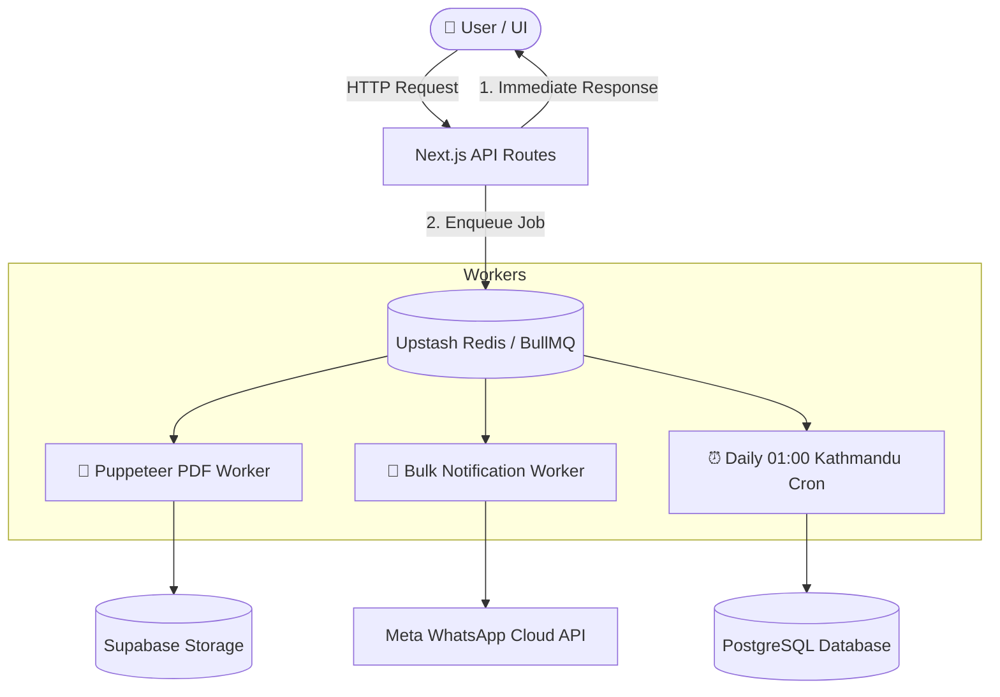

# 18. Phase 3 — Background Jobs, BullMQ/Redis Queues & Scheduled Crons

> **What was built in this milestone:**
> - **BullMQ + Redis (Upstash) Asynchronous Queues** (`lib/queue.ts`):
>   - `pdf-generation-queue`: Offloads heavy server-side Puppeteer rendering for Quotes, Vouchers, and Invoices to background workers.
>   - `notification-broadcast-queue`: Handles batch WhatsApp and email sends with retries and exponential backoff.
> - **Daily 01:00 Kathmandu-Time Maintenance Cron** (`lib/cron-maintenance.ts` & `POST /api/cron/daily-maintenance`):
>   - **Overdue Ledger Scanner**: Identifies and flags overdue `ClientLedger` receivables and `SupplierLedger` payables past their due date.
>   - **1-Year Trip Archival**: Automatically transitions stale completed/cancelled/dropped trips past the 1-year mark to `is_archived = true`.
> - **Request-Response Non-Blocking Audit**: Audited Parts 4, 5, and 6 endpoints to confirm zero heavy operations block the HTTP request cycle.

---

## ⚡ Background Queue Topology



---

## ⚡ Vibe Coder Cheat Sheet

```bash
# 1. Run Background Jobs & Scheduled Crons test suite
npx tsx scripts/test-phase3-background-jobs-and-crons.ts

# 2. Trigger Daily System Maintenance Manually:
curl -X POST http://localhost:3000/api/cron/daily-maintenance \
  -H "Authorization: Bearer your-cron-secret"

# 3. Request Quote PDF via Async BullMQ Queue:
curl -X POST "http://localhost:3000/api/quotes/YOUR_QUOTE_ID/generate-pdf?async=true" \
  -H "Content-Type: application/json" \
  -d '{"recipient_email": "guest@example.com"}'
```
