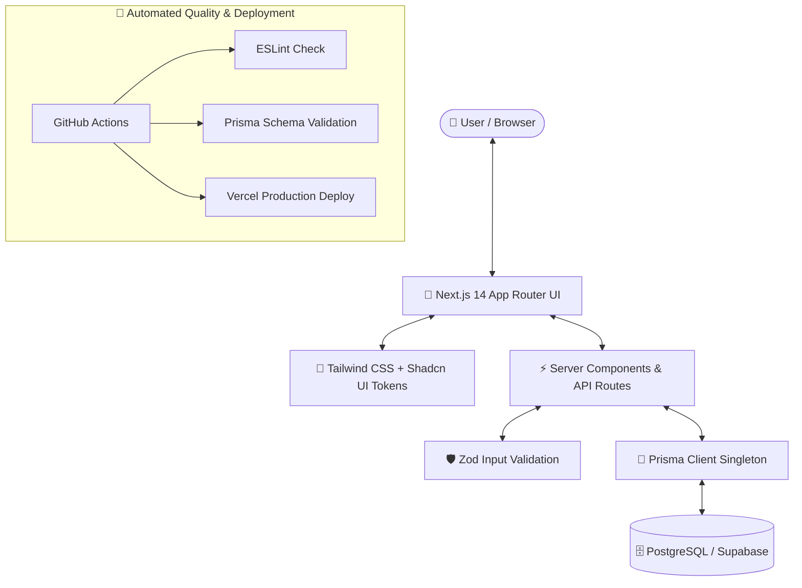

# 🧭 Travel CRM SaaS — Step-by-Step Vibe Coder Blueprint & Tutorial

Welcome to the **SunNFun Travel CRM Build Guide**! 

This tutorial is specially crafted for **semi-technical vibe coders**, founders, and builders. It pulls back the curtain on everything Google Antigravity Agent does behind the scenes, explains **why** specific technologies were chosen, and gives you actionable, step-by-step shortcuts to navigate, customize, and extend the system with confidence.

---

## 📚 Table of Contents

| Guide | Description | Target Audience / Goal |
|---|---|---|
| **[00. Quickstart & Shortcuts Cheat Sheet](./00-quickstart-cheat-sheet.md)** | Essential terminal commands, keyboard shortcuts, and file map. | Quick lookups & fast copy-pasting |
| **[01. Step 1 — Project Initialization & Infrastructure](./01-project-initialization.md)** | Full walkthrough of how the foundation was built from scratch. | Understand every agent action & decision |
| **[02. Understanding the Tech Stack & Architecture](./02-understanding-the-tech-stack.md)** | Plain-English breakdown of Next.js 14, Tailwind, Shadcn, Prisma, & CI/CD. | Master the "Why" and the system logic |
| **[03. Antigravity Agent Mechanics & Best Practices](./03-antigravity-agent-guide.md)** | How planning mode, artifacts, rules, and subagents work. | Learn how to guide the AI effectively |
| **[04. Phase 0 — Core Org, User & Multi-Tenant Schema](./04-phase0-org-and-multi-tenancy-schema.md)** | Schema design, Passkeys, 2FA enums, and auto-org-scoping extension. | Master multi-tenant database isolation |
| **[05. Phase 0 — Auth Flows: Passkeys, 2FA & RBAC](./05-phase0-auth-flows-passkeys-and-rbac.md)** | NextAuth.js, @simplewebauthn, TOTP, RBAC middleware, Login UI. | Master the full auth & security layer |
| *[06. Phase 1 — CRM Core, Master Data & Quoting Engine (Upcoming)]* | Will cover Trips, Hotels, Rate Resolution, & Itineraries. | Automatically added in Phase 1 |
| *[07. Phase 2 — Bookings, Operations & Financial Ledger (Upcoming)]* | Will cover Service Vouchers, Payments, & Driver/Guide sheets. | Automatically added in Phase 2 |
| *[08. Phase 3 — Automations & AI Agent Layer (Upcoming)]* | Will cover n8n webhooks, WhatsApp, & AI Quote Suggestions. | Automatically added in Phase 3 |

---

## 🗺️ Visual Project Architecture

Here is how all the pieces connect together:

---

## 🎯 What Makes a Great "Vibe Coder"?

Being a vibe coder doesn't mean writing code blind. It means:
1. **Understanding the System Flow**: Knowing which file is responsible for what.
2. **Reviewing Critical Logic**: Checking inputs (Zod schemas), database calls (Prisma), and security rules (Multi-Tenancy).
3. **Delegating Repetitive Work to AI**: Letting Antigravity scaffold UI, configure packages, and write boilerplate while you orchestrate the big picture.

Let's dive into [Step 0: Quickstart Cheat Sheet](./00-quickstart-cheat-sheet.md) to get started!
